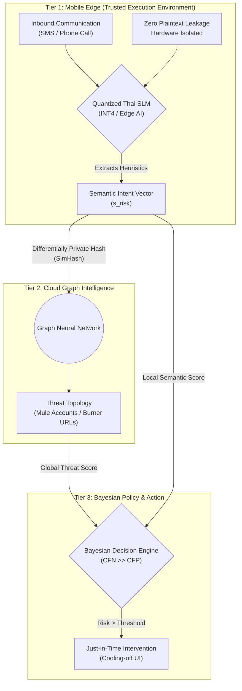

# Pre-Transaction Scam Defense: A Pareto-Optimized Edge-Cloud Architecture for Semantic Intent Extraction

**Abstract**  
Contemporary financial fraud defense mechanisms rely heavily on post-transaction anomaly detection and static metadata blacklisting, rendering them highly vulnerable to Authorized Push Payment (APP) fraud and zero-day social engineering. In these scenarios, adversaries psychologically manipulate users into bypassing cryptographic multi-factor authentication (MFA). Furthermore, structural information asymmetry—where telecommunications providers observe coercive communications but lack financial context, and banks observe transactions without the preceding psychological context—exacerbates this vulnerability. This paper proposes a novel, pre-transaction Edge-Cloud Semantic Intent Architecture. By deploying highly quantized Small Language Models (SLMs) locally within a Trusted Execution Environment (TEE), the system extracts a "Semantic Intent Vector" without plaintext data leakage. We frame this distributed architecture as a Pareto workload offloading optimization, coupling local heuristic extraction with Cloud-based Graph Neural Networks for global threat correlation. Finally, we introduce a Bayesian Cost-Asymmetric UI intervention to mitigate warning fatigue, intercepting transactions precisely at the trust boundary.

---

## 1. Introduction & Rationale
The fundamental limitation of existing financial fraud defense is its reactive nature. Legacy paradigms fail catastrophically against Zero-Day Social Engineering because the adversary coerces the human to bypass cryptographic authentication themselves. The system successfully verifies the *identity* of the user, but remains entirely blind to the coerced *intent* of the transaction.

Furthermore, current defense mechanisms suffer from structural **Information Asymmetry (Silo Blindness)**. Let $\mathcal{I}_{\text{carrier}}$ represent the information state of the telecommunications provider and $\mathcal{I}_{\text{bank}}$ represent the information state of the financial institution. Currently, $\mathcal{I}_{\text{bank}} \cap \mathcal{I}_{\text{carrier}} = \emptyset$. Attempting to solve this by streaming all user communications to a centralized cloud AI introduces unacceptable latency and violates stringent privacy regulations (e.g., PDPA, GDPR).

## 2. Threat Model: The Trust Boundary Breach
The proposed system addresses a critical vulnerability in modern cybersecurity: the psychological bypass of cryptographic MFA. We frame this theoretically as a violation of the Principle of Psychological Acceptability [5]. While cryptographic systems verify identity, they fail to verify the *semantic intent* of the transaction. Our architecture bridges this gap by acting as a Global Semantic Observer, collapsing the information asymmetry necessary for the scam to succeed.

## 3. Proposed Architecture
To bridge this gap, we propose a 3-Tier Edge-Cloud Semantic Observer. The workload is partitioned mathematically to satisfy strict latency and privacy bounds: $\min (\text{Latency})$ subject to $(\text{Privacy} \ge \epsilon, \text{Accuracy} \ge \tau)$.

### 3.1 Tier 1: Edge TEE (Trusted Execution Environment)
Operating directly on the user's mobile device, this layer intercepts incoming communications via authorized OS APIs. A quantized Small Language Model (SLM), running within a hardware-isolated Secure Enclave (e.g., ARM TrustZone), evaluates the text for psychological heuristics (Authority Claim, Urgency Framing). It computes a localized Semantic Intent Vector ($s_{\text{risk}} \in \mathbb{R}^d$) with zero plaintext exfiltration.

### 3.2 Tier 2: Cloud Graph Intelligence
If the Edge vector $s_{\text{risk}}$ exceeds an uncertainty threshold, the device transmits a differentially private cryptographic signature (e.g., SimHash) to the Cloud. This layer utilizes Graph Neural Networks (GNNs) to correlate the signature against a global threat topology $\mathcal{G} = (\mathcal{V}_{\text{entity}}, \mathcal{E}_{\text{flow}})$.

### 3.3 Tier 3: Bayesian Policy & UI Intervention
The final decision engine merges Edge semantic scores and Cloud graph scores. Governed by **Bayesian Cost-Asymmetric Decision Theory**, the system recognizes that the cost of a false negative (financial ruin) drastically outweighs a false positive (UX friction). The system formally bounds the threshold ($C_{FN} \gg C_{FP}$), triggering a UI interruption precisely before the user transfers funds.

### Architecture Flowchart

## 4. System Workflow (Kill Chain Intervention)
The following sequence illustrates the step-by-step lifecycle of an Authorized Push Payment (APP) scam attempt, demonstrating exactly where the Edge-Cloud architecture intercepts the transaction at the Trust Boundary.

```mermaid
sequenceDiagram
    autonumber
    actor Scammer
    actor User
    participant Edge as Edge TEE (SLM)
    participant Cloud as Cloud Graph (GNN)
    participant Bank as Banking App
    
    Scammer->>User: Sends Coercive SMS ("Urgent: Account Frozen")
    User->>Edge: Device OS receives message
    
    rect rgb(20, 40, 60)
        Note over Edge: Pre-Transaction Semantic Extraction
        Edge->>Edge: SLM evaluates Authority/Urgency (Zero Data Leak)
        Edge->>Cloud: Send Differentially Private Signature (SimHash)
        Cloud-->>Edge: Return Metadata Threat Score
    end
    
    User->>Bank: Opens App & attempts to transfer funds
    
    rect rgb(60, 20, 20)
        Note over Edge, Bank: Trust Boundary Intervention
        Edge->>Bank: Trigger Bayesian Risk Policy Evaluation
        Bank-->>User: Display "Cooling-Off" Warning UI
    end
    
    User->>Scammer: Transaction Aborted (Funds Secured)
```

## 5. Evaluation Methodology
To rigorously validate the proposed architecture, we define five orthogonal evaluation metrics across Security, Systems, and Human-Computer Interaction (HCI):

1.  **Constrained Recall (Efficacy):** We measure True Positive Rate strictly bounded by a maximum acceptable False Positive Rate ($FPR \le 0.1\%$) to prevent warning fatigue.
2.  **Adversarial Robustness (Evasion):** We evaluate model degradation against an adversarial "Evasion Dataset" containing structural perturbations bounded by a $k$-edit distance $\mathcal{A} = \{ x' \mid d_{\text{edit}}(x, x') \le k \}$.
3.  **Pre-Transaction Timeliness (Lead Time):** The median temporal delta ($\Delta t$) between the system's internal risk flag and the adversary's request for a money transfer.
4.  **System Overhead:** We target a p95 inference latency of $\le 300\text{ms}$ on mid-tier mobile hardware, alongside peak RAM quantification for the quantized SLM.
5.  **HCI Compliance Rate:** A simulated user study measuring the proportion of users who abandon a coercive transfer when presented with the Bayesian warning UI versus standard OS-level warnings (Chi-square test of independence, $p < 0.05$).

## 6. Discussion: Scalability & Commercial Impact
This architecture shifts the paradigm from post-transaction reaction to **pre-transaction semantic intervention**. By running SLMs locally, the system creates a massive privacy-preserving moat for the FinTech and Telecommunication sectors. It allows institutions to dramatically reduce their fraud liability without requiring them to share highly regulated, plaintext user data with third-party clouds.

## 7. Conclusion
*"เตือนอย่างมีเหตุผล ในเวลาที่ผู้ใช้ยังเลือกได้"* (Warn with reason, at the time the user still has a choice). By collapsing the information asymmetry between telecommunications and financial sectors through a privacy-preserving Edge-Cloud architecture, we provide a robust, mathematically bounded mechanism to intercept social engineering attacks precisely before catastrophic financial loss occurs.

## References
1. **Mao, Y., et al.** (2017). *A survey on mobile edge computing: The communication perspective.* IEEE Communications Surveys & Tutorials.
2. **Anderson, R.** (2001). *Why information security is hard-an economic perspective.* ACSAC.
3. **Madry, A., et al.** (2018). *Towards Deep Learning Models Resistant to Adversarial Attacks.* ICLR.
4. **Elkan, C.** (2001). *The foundations of cost-sensitive learning.* IJCAI.
5. **Saltzer, J. H., & Schroeder, M. D.** (1975). *The protection of information in computer systems.* Proceedings of the IEEE.
6. **Akhawe, D., & Felt, A. P.** (2013). *Alice in Warningland: A large-scale field study of browser security warning effectiveness.* USENIX.
7. **Kang, J., et al.** (2020). *Reliable federated learning for mobile networks.* IEEE Wireless Communications.
