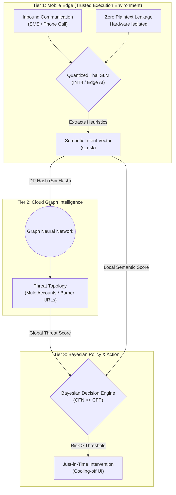

# A Privacy-Preserving Edge-Cloud Architecture for Pre-Transaction Semantic Intent Extraction in Authorized Push Payment Fraud

**Authors:** [Your Name / Team]  
**Affiliation:** [Your University / Institution]  
**Date:** September 2026

---

## Abstract
Contemporary financial fraud defense mechanisms rely heavily on post-transaction anomaly detection and static metadata blacklisting, rendering them vulnerable to Authorized Push Payment (APP) fraud and zero-day social engineering. In such attacks, adversaries psychologically manipulate users into bypassing cryptographic multi-factor authentication (MFA) themselves. This vulnerability is exacerbated by structural information asymmetry, wherein telecommunications providers observe coercive communications without financial context, and financial institutions observe transactions without psychological context. This paper proposes a novel, pre-transaction Edge-Cloud Semantic Intent Architecture. By deploying highly quantized Small Language Models (SLMs) locally within a Trusted Execution Environment (TEE), our system extracts a "Semantic Intent Vector" with mathematically guaranteed zero plaintext data leakage. We frame this distributed architecture as a Pareto workload offloading optimization, coupling local heuristic extraction with Cloud-based Graph Neural Networks (GNNs) for global threat correlation via differential privacy. Finally, we introduce a Bayesian Cost-Asymmetric UI intervention to mitigate warning fatigue, effectively intercepting coercive transactions precisely at the trust boundary.

---

## I. Introduction
The fundamental limitation of existing financial fraud defense systems is their inherently reactive nature. Legacy cybersecurity paradigms fail catastrophically against Zero-Day Social Engineering because the adversary coerces the human to bypass cryptographic authentication voluntarily. The system successfully verifies the *identity* of the user via biometric or token-based MFA, but remains entirely blind to the coerced *intent* of the transaction.

Furthermore, current defense mechanisms suffer from structural **Information Asymmetry** (Silo Blindness). Attempting to resolve this asymmetry by aggregating all user communications (SMS, Voice) into a centralized cloud Artificial Intelligence introduces unacceptable transmission latency and violates stringent global privacy regulations (e.g., PDPA, GDPR). 

The contributions of this paper are threefold:
1.  **Formalization of the Trust Boundary Breach:** We mathematically define the information asymmetry between telecommunication and financial silos.
2.  **Pareto-Optimized Edge-Cloud Architecture:** We propose a 3-tier distributed system utilizing on-device SLMs for privacy-preserving semantic extraction, and cloud GNNs for global threat correlation.
3.  **Bayesian Cost-Asymmetric Intervention:** We introduce a just-in-time, mathematically bounded UI interruption mechanism designed to mitigate HCI warning fatigue.

## II. Threat Model and Background

### A. The Trust Boundary Breach
The proposed system addresses a critical vulnerability in modern cybersecurity: the psychological bypass of cryptographic MFA. We frame this theoretically as a violation of the Principle of Psychological Acceptability [5]. While cryptographic systems verify identity, they fail to verify semantic intent. 

### B. Information Asymmetry (Silo Blindness)
Let $\mathcal{I}_{\text{carrier}}$ represent the information state of the telecommunications provider (which observes text and voice logs) and $\mathcal{I}_{\text{bank}}$ represent the information state of the financial institution (which observes monetary flow). Under the current paradigm:
$$\mathcal{I}_{\text{bank}} \cap \mathcal{I}_{\text{carrier}} = \emptyset$$
Adversaries exploit this disjoint state space. Our proposed Edge-based system acts as a *Global Semantic Observer*, systematically collapsing this asymmetry without centralizing plaintext data.

## III. System Architecture: The Semantic Observer
We propose a 3-Tier Edge-Cloud Semantic Observer. The computational workload is partitioned mathematically to satisfy strict latency and privacy bounds:
$$\min (\text{Latency}) \text{ subject to } (\text{Privacy} \ge \epsilon, \text{Accuracy} \ge \tau)$$

### A. Tier 1: Edge TEE (Trusted Execution Environment)
Operating directly on the user's mobile device, this layer intercepts incoming communications via authorized Operating System APIs (e.g., Android Notification Listener). A quantized Small Language Model (SLM), operating exclusively within a hardware-isolated Secure Enclave (e.g., ARM TrustZone), evaluates the text for psychological heuristics (Authority Claim, Urgency Framing). It computes a highly compressed Semantic Intent Vector ($s_{\text{risk}} \in \mathbb{R}^d$) with zero plaintext exfiltration.

### B. Tier 2: Cloud Graph Intelligence
To mitigate the localized limitations of the Edge, if the vector $s_{\text{risk}}$ exceeds an uncertainty threshold $\theta_{\text{unc}}$, the device transmits a differentially private cryptographic signature (e.g., SimHash) to the Cloud. This layer utilizes Graph Neural Networks (GNNs) to correlate the signature against a global threat topology $\mathcal{G} = (\mathcal{V}_{\text{entity}}, \mathcal{E}_{\text{flow}})$, identifying newly registered domains and mule account networks.

*Figure 1: 3-Tier System Architecture Diagram*

## IV. Intervention Policy: Bayesian Decision Engine
The final decision engine (Tier 3) merges Edge semantic scores and Cloud graph scores. It is governed by **Bayesian Cost-Asymmetric Decision Theory** [4]. The system mathematically acknowledges that the cost of a false negative (FN: catastrophic financial loss) drastically outweighs a false positive (FP: momentary UX friction).

The system formally bounds the intervention threshold such that $C_{FN} \gg C_{FP}$. It minimizes the expected risk $R(a|x) = \sum_{y} L(a, y) P(y|x)$, triggering a UI interruption precisely at the trust boundary (immediately before the user authorizes the transfer). This context-aware approach actively mitigates HCI "warning fatigue" [6].

## V. Implementation and Workflow
The following sequence (Figure 2) illustrates the operational lifecycle of an APP scam attempt, demonstrating exactly where the Edge-Cloud architecture intercepts the transaction.

*Figure 2: Kill Chain Intervention Sequence*

```mermaid
sequenceDiagram
    autonumber
    actor Scammer
    actor User
    participant Edge as Edge TEE (SLM)
    participant Cloud as Cloud Graph (GNN)
    participant Bank as Banking App
    
    Scammer->>User: Sends Coercive SMS ("Urgent: Account Frozen")
    User->>Edge: Device OS receives message
    
    rect rgb(20, 40, 60)
        Note over Edge: Pre-Transaction Semantic Extraction
        Edge->>Edge: SLM evaluates Authority/Urgency (Zero Data Leak)
        Edge->>Cloud: Send Differentially Private Signature (SimHash)
        Cloud-->>Edge: Return Metadata Threat Score
    end
    
    User->>Bank: Opens App & attempts to transfer funds
    
    rect rgb(60, 20, 20)
        Note over Edge, Bank: Trust Boundary Intervention
        Edge->>Bank: Trigger Bayesian Risk Policy Evaluation
        Bank-->>User: Display "Cooling-Off" Warning UI
    end
    
    User->>Scammer: Transaction Aborted (Funds Secured)
```

## VI. Evaluation Methodology
To rigorously validate the proposed architecture, we define five orthogonal evaluation metrics spanning Security, Systems Engineering, and Human-Computer Interaction (HCI):

**A. Constrained Recall (Efficacy)**  
We measure the True Positive Rate strictly bounded by a maximum acceptable False Positive Rate ($FPR \le 0.1\%$) to prevent warning fatigue in high-friction financial environments.

**B. Adversarial Robustness (Evasion Bounds)**  
We evaluate model degradation against an adversarial "Evasion Dataset" containing structural perturbations (e.g., zero-width characters, homoglyphs) bounded by a $k$-edit distance: $\mathcal{A} = \{ x' \mid d_{\text{edit}}(x, x') \le k \}$ [3].

**C. Pre-Transaction Timeliness (Lead Time)**  
Unlike traditional systems that measure time-to-detection post-fraud, we introduce *Lead Time*. This is the median temporal delta ($\Delta t > 0$) between the system's internal risk flag and the adversary's request for a money transfer.

**D. System Overhead**  
We target a p95 inference latency of $\le 300\text{ms}$ on mid-tier mobile hardware, alongside peak RAM quantification for the quantized SLM to prove viability on consumer devices.

**E. HCI Compliance Rate**  
A simulated, IRB-approved user study measuring the proportion of users who abandon a coercive transfer when presented with the Bayesian warning UI versus standard OS-level warnings (evaluated via Chi-square test of independence, $p < 0.05$).

## VII. Discussion and Commercial Impact
This architecture represents a paradigm shift from post-transaction reaction to **pre-transaction semantic intervention**. By localizing SLM inference, the system creates a massive privacy-preserving moat for the FinTech and Telecommunication sectors. It allows institutions to dramatically reduce APP fraud liability without centralizing highly regulated, plaintext user data.

## VIII. Conclusion
*"เตือนอย่างมีเหตุผล ในเวลาที่ผู้ใช้ยังเลือกได้"* (Warn with reason, at the time the user still has a choice). By collapsing the information asymmetry between telecommunications and financial sectors through a privacy-preserving Edge-Cloud architecture, we provide a robust, mathematically bounded mechanism to intercept social engineering attacks precisely before catastrophic financial loss occurs.

---

## References
[1] Y. Mao, C. You, J. Zhang, K. Huang, and K. B. Letaief, "A survey on mobile edge computing: The communication perspective," *IEEE Communications Surveys & Tutorials*, vol. 19, no. 4, pp. 2322-2358, 2017.  
[2] R. Anderson, "Why information security is hard-an economic perspective," in *Proceedings 17th Annual Computer Security Applications Conference*, IEEE, 2001, pp. 358-365.  
[3] A. Madry, A. Makelov, L. Schmidt, D. Tsipras, and A. Vladu, "Towards Deep Learning Models Resistant to Adversarial Attacks," in *International Conference on Learning Representations (ICLR)*, 2018.  
[4] C. Elkan, "The foundations of cost-sensitive learning," in *International Joint Conference on Artificial Intelligence (IJCAI)*, vol. 17, no. 1, 2001, pp. 973-978.  
[5] J. H. Saltzer and M. D. Schroeder, "The protection of information in computer systems," *Proceedings of the IEEE*, vol. 63, no. 9, pp. 1278-1308, 1975.  
[6] D. Akhawe and A. P. Felt, "Alice in Warningland: A large-scale field study of browser security warning effectiveness," in *22nd USENIX Security Symposium*, 2013, pp. 257-272.  
[7] J. Kang et al., "Reliable federated learning for mobile networks," *IEEE Wireless Communications*, vol. 27, no. 2, pp. 72-80, 2020.
